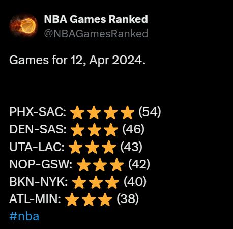

## NBA Games Ranked
NBA Games Ranked is a free service that tweets a ranking of the previous day's NBA games, without revealing the final scores. It's designed to help NBA fans in non-American time zones find and watch the most exciting games. Follow me on Twitter: @NBAGamesRanked.

## How it works
First, we collect data from RapidAPI and calculate the score for each game. The score is based on the number of arbitrary parameters. This is happening in the `nba_games_ranked.py` script that runs in a cloud as a cron job. Tha ranking is saved in a csv file. 
Then, another script `tweet_ranking.py` - also running as a cron job - reads the ranking from the csv file and tweets it on @NBAGamesRanked account.

## Installation notes
A high level overview of the installation process:
1. Set up a VM machine
2. Install Python virtual environment (venv) and required packages (see `requirements.txt`)
3. Set up a Twitter Developer account and get the necessary API keys
4. Set up a RapidAPI account and get the necessary API keys
5. Write keys to a `.env` file
6. Set up a cron job to run 'nba_games_ranked.py' and 'tweet_ranking.py' scripts. The latter should run after the former finishes, so give it a few minutes head start.

## Licensing
This project utilizes a dual licensing model:
- GNU GPL v3.0: This open-source license permits commercial use but mandates that any derivatives also be distributed under the same terms.
- Commercial License: Intended for proprietary applications without the obligation to release the source code. For commercial licensing inquiries, please contact ma at manduk.ai.
